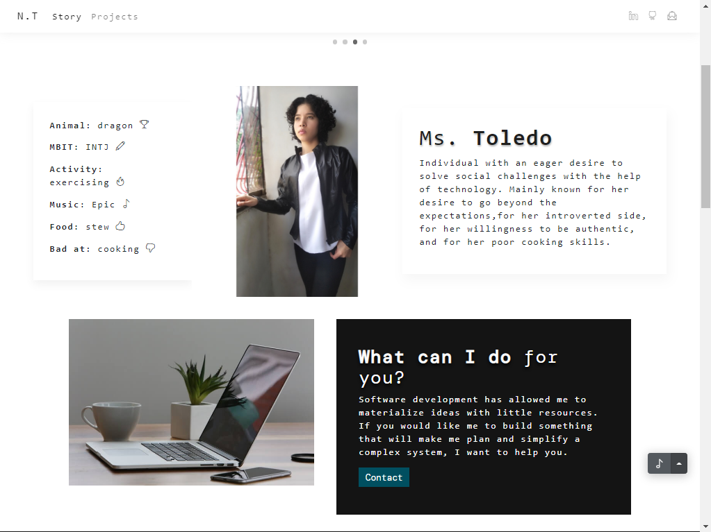
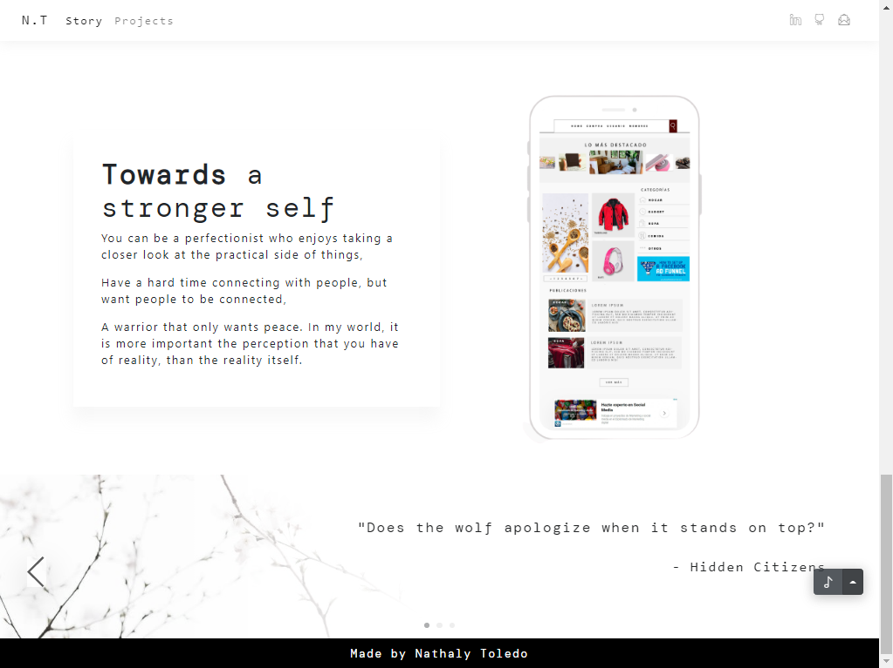

# Personal Website
### _Getting to know about Nathaly Toledo_

A static website used to highlight personal stories and projects. There are two web pages:
- Story
- Projects

## Sections
### Story
The page covers the following:
-	Facts.
-	A short description of the person.
-	A call to action.
-	Core values and interests.
-	A project gallery.
-	Personal quotes.

### The Front-End
The page covers the following about each highlighted projects:
-	A project overview.
-	A project gallery.

## Tech
- [JavaScript] -  a programming language that conforms to the ECMAScript specification
- [HTML5] -  a markup language used for structuring and presenting content
- [CSS3] - a style sheet language
- [Bootstrap] - a free and open-source CSS framework

[//]: # (These are reference links used in the body of this note and get stripped out when the markdown processor does its job.)

   [Javascript]: <https://www.javascript.com//>
   [HTML5]: <https://html.spec.whatwg.org/>
   [CSS3]: <https://developer.mozilla.org/en-US/docs/Web/CSS/>
   [Bootstrap]: <https://getbootstrap.com/>
